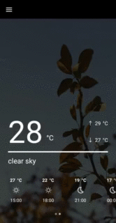
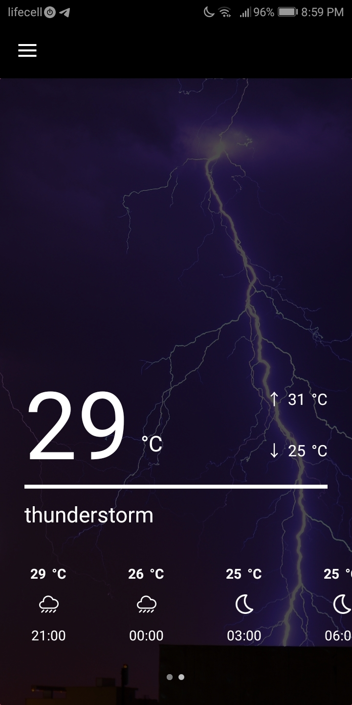
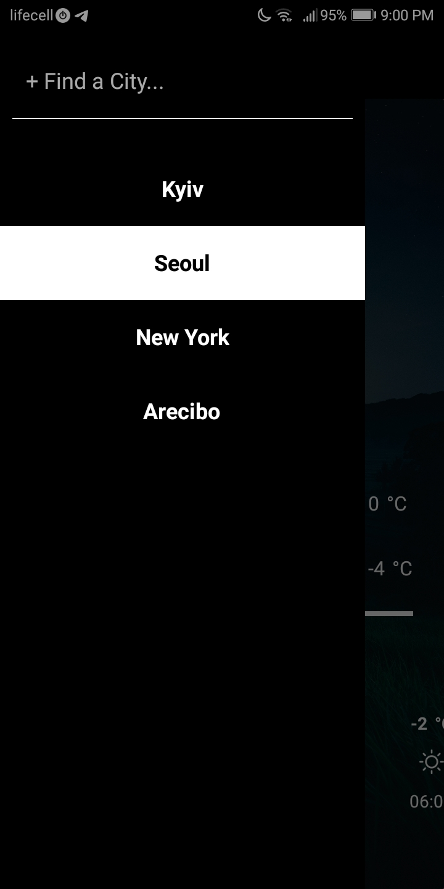
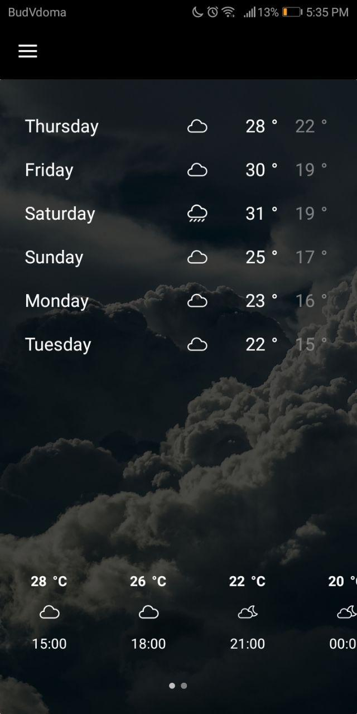

# Weather App for Android
Weather App in Xamarin Forms with MVVM using Weather API

Weatherapp is a simple forecast app, which uses some APIs to fetch 5 day / 3 hour forecast data
from the OpenWeatherMap and to fetch cities and counties.

The main goal of this app is to be a sample of how to build 
an Android application using Xamarin.

# Features:

- Simple Design
- Unique Images for Each Type of Weather
- Current Weather
- Detailed 5 days Forecast
- 7 Day Forecast
- Search Any City
- Add Cities to Your Personal List and Remove Them

# Few More Screenshots with Different Weather:

   <table align="center" border="0">
  <tr>
    <td>

       <td>
    </td>
     <td> </td>
  </table>

